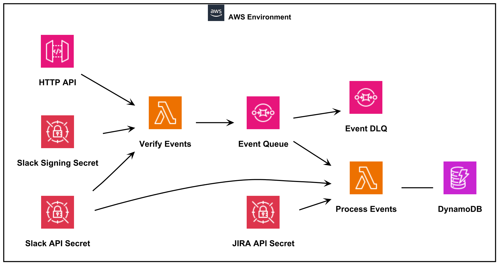
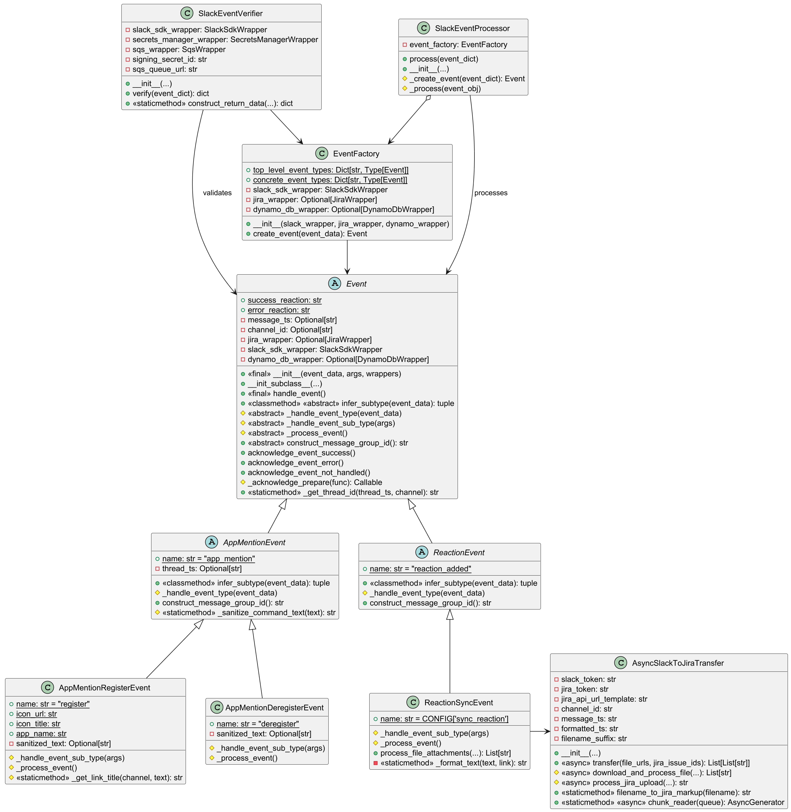

[](https://opensource.org/licenses/Apache-2.0)

# Slack to Jira

A slack bot that allows linking slack threads to JIRA and copying messages to linked JIRA issues as comments.

The bot is hosted on AWS and makes use of corresponding slack and JIRA API modules in python.

Deployment is done using terraform.

The bot can easily be extended and incorporate other commands that might help document important information from slack into JIRA tickets for future reference.

With the current offering, the bot provides 3 options.

* Registering a slack thread with a JIRA ticket.

* Deregistering a slack thread, after it had been previously registered.

* Adding a specific reaction to a slack message of a registered thread.

# Architecture

## AWS Details
The project follows a simple architecture with an HTTP API Gateway that provides integration between slack and the rest of the solution outlined here. The HTTP API Gateway in this context does not provide satisfactory security. However, it can be replaced with a REST API Gateway, alongside some components (WAF) that can better protect it.

The processor code can be re-used if you want to set up your bot with socket mode.



Most of the code in the two Lambda functions is shared. The first lambda is tasked only with early validation of the event and subsequent sending of a corresponding even to the SQS queue.

By sharing the code in a common layer, we avoid the risk of having the two functions go out of sync.

A FIFO queue is used to guarantee no duplicate event processing or race conditions. The message group ID is established according to Slack event type, once the event has been verified.

## Class design



# Setup notes

* Download and set up [terraform](https://developer.hashicorp.com/terraform/tutorials/aws-get-started/install-cli).

* Download and setup [podman](https://podman.io/docs/installation).
  * If you are running on windows, you will need [WSL](https://learn.microsoft.com/en-us/windows/wsl/install).
  * If you are running on a non ARM64 architecture, please make sure to set up QEMU.
      ```
      sudo podman run --rm --privileged multiarch/qemu-user-static --reset -p yes
      ```

* Download and setup [poetry](https://python-poetry.org/docs/basic-usage/)

* Checkout this project.

* Once the environment is setup, you can establish the pre-commit hooks.
  ```
  pre-commit install -f
  ```

* Create a tfvars file and provide the necessary values for the variables outlined in [variables.tf](variables.tf).

* Deploy your solution with terraform:
  ```bash
  terraform init
  terraform workspace new test  # or use existing workspace
  terraform plan -var-file=test.tfvars
  terraform apply -var-file=test.tfvars
  ```
  Note: The initial local installation of layer dependencies might take the majority of time.

# Usage

Once deployed, the bot can be used in Slack with the following interactions:

## Registering a Thread with a JIRA Ticket

1. In a Slack thread, mention the bot with a JIRA ticket key:
   ```
   @bot-name register PROJ-123 <text>
   ```
2. The bot will create a remote link between the Slack thread and the JIRA ticket. Clicking the link will take you back to the corresponding thread.

## Deregistering a Thread

1. In a previously registered thread, mention the bot with the deregister command:
   ```
   @bot-name deregister PROJ-123
   ```
2. The remote link will be removed from the JIRA ticket.

## Syncing Messages to JIRA

1. In a registered thread, add the configured sync reaction to any message.
2. The message content will be copied to the linked JIRA ticket as a comment.
3. File attachments will also be transferred to the JIRA ticket.

A reaction will be put in the corresponding slack message to signal success or failure for each of the commands listed above.

# Configuration

## Required Secrets

The following secrets must be provided through terraform variables:

- **jira_token**: API token for authenticating with JIRA
- **slack_token**: Bot user OAuth token (starts with `xoxb-`)
- **slack_signing_secret**: Signing secret for verifying Slack requests

## Slack App Configuration

To use this bot, you need to create a Slack App with the following:

### Bot Token Scopes
- `channels:history` - Read message history
- `chat:write` - Send messages
- `reactions:read` - Read reactions
- `reactions:write` - Add reactions
- `files:read` - Access file information
- `app_mentions:read` - Receive app mention events

### Event Subscriptions
Subscribe to bot events:
- `app_mention` - When the bot is mentioned
- `reaction_added` - When a reaction is added

The [Manifest Template](manifest_template.yml) can also help you quickly setup your bot with as per the guidelines provided above.

## JIRA Configuration

1. Generate an API token from your JIRA account settings
2. Ensure the JIRA user has permissions to:
   - Create remote links
   - Add comments to issues
   - Attach files to issues

# Troubleshooting

## Lambda Function Errors

Check CloudWatch Logs for detailed error messages:
```
aws logs tail /aws/lambda/slack-event-verify --follow
aws logs tail /aws/lambda/slack-event-process --follow
```

# Contributing

We welcome contributions! Please see [CONTRIBUTING.md](CONTRIBUTING.md) for guidelines.

# License

This project is licensed under the Apache License 2.0. See [LICENSE](LICENSE) for details.

# Support

For issues, questions, or contributions, please use the GitHub issue tracker.